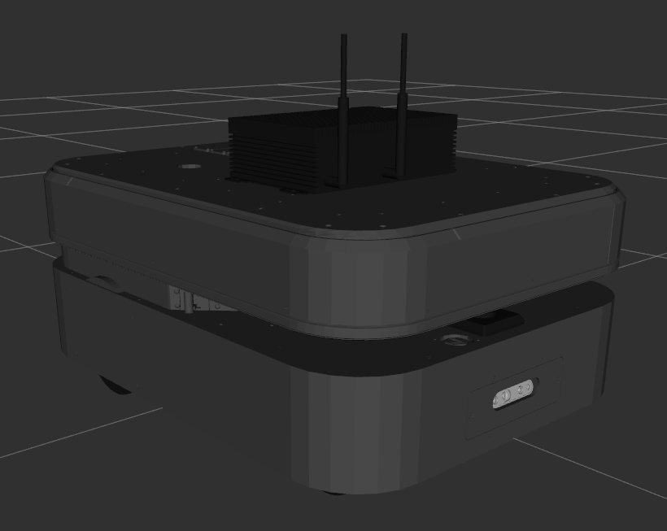

Boxer
========

This repository contains the description, messages, and basic navigation packages for Boxer 2.4.

NOTE: Boxer 2.4 is _not_ compatible with the older Boxer that ran on ROS Kinetic and earlier.  Older Boxer robots
are not supported past ROS Kinetic, and will not work with this repository.

Boxer 2.4 uses an unmodified Otto 100 base, running a customized version of ROS2.  In order to provide compatibility
with ROS Noetic, we use the `ros1_bridge` package running under ROS2 Foxy to provide the necessary translation between
the ROS1 and ROS2 topics.

Packages
----------

This repository contains 4 ROS packages for use with Clearpath's Boxer 2.4, running ROS Noetic:

- `boxer_description` -- the Boxer's URDF and associated STL files
- `boxer_msgs` -- message definitions used by various Boxer packages
- `boxer_control` -- configuration and launch files for Boxer's control nodes (both real & simulation)
- `boxer_navigation` -- odometry, amcl, and gmapping demos

For description customization, please see the [boxer_description](boxer_description/README.md)'s documentation.
